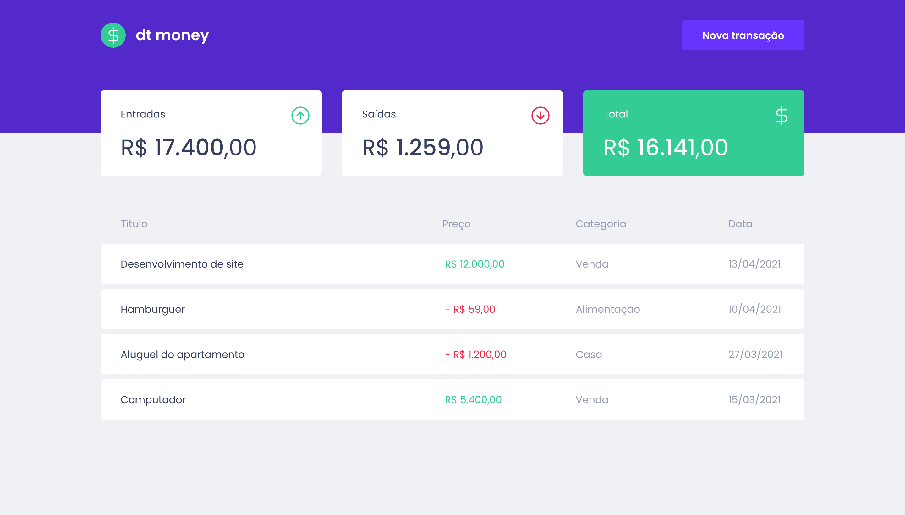

<p align="center">
   
</p>

<p align="center">
  
  
  
</p>

<p align="center">
  Projeto para gerenciar o seu dinheiro, desenvolvido durante o segundo módulo do treinamento de ReactJS do Ignite.

  
</p>

## Tecnologias

- [React](https://reactjs.org/)
- [Typescript](https://www.typescriptlang.org/)
- [Styled Components](https://styled-components.com/)
- [MirageJS](https://miragejs.com/)

---
<br />

## Como usar

### Clone o projeto:

```sh

git clone https://github.com/HigorDenomar/dtmoney

```

### Rode o projeto (npm)

```sh
# Entre na pasta do projeto
cd dtmoney

# Instale as dependências
npm install

# Rode o projeto (ele será aberto em http://localhost:3000)
npm start

```

#### Ou, se preferir o yarn:

```sh
# Entre na pasta do projeto
cd dtmoney

# Instale as dependências
yarn

# Rode o projeto (ele será aberto em http://localhost:3000)
yarn start

```

---
<br />

<p>Com ❤️ <a src="https://github.com/HigorDenomar" alt="Higor Denomar">Higor Denomar</a> </p>

<a href="https://www.linkedin.com/in/higordenomar/">
  
</a>
<a href="mailto:contato.higordenomar@hotmail.com">
  
</a>
